# UI Autotests Project on "Aviasales" search engine testing
> <a target="_blank" href="https://www.aviasales.com/">Link to the search engine site</a>

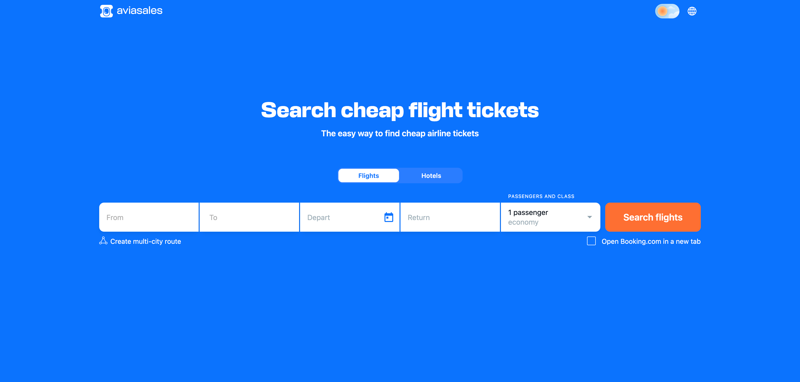

## The project is implemented with the use of the following technologies:
Python Pytest Selene PyCharm Poetry Selenoid Jenkins GitHub Allure Report Allure TestOps Jira

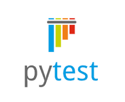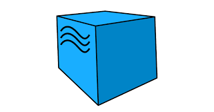

#### List of verifications executed in autotests:
- [x] Search of flights without return ticket for 1 adult passenger (economy class)
- [x] Search of flights with return ticket for 2 adult passengers (business class)
- [x] Search of flights without return ticket for different age passengers (economy class)
- [x] Search of hotels for 1 guest
- [x] Search of hotels for 2 guests
#### List of manual tests
- [x] Search of only direct flights
- [x] Search of tickets only with baggage included
- [x] Verification of possiblity to buy a ticket
- [x] Verification of possibility to select a ticket

# Autotests were launched on Jenkins server
> <a target="_blank" href="https://jenkins.autotests.cloud/job/UI_tests_aviasales/">Link to the project in Jenkins</a>

### Build parameters

* login (default user1)
* password (default 1234)

### Tests launch in Jenkins
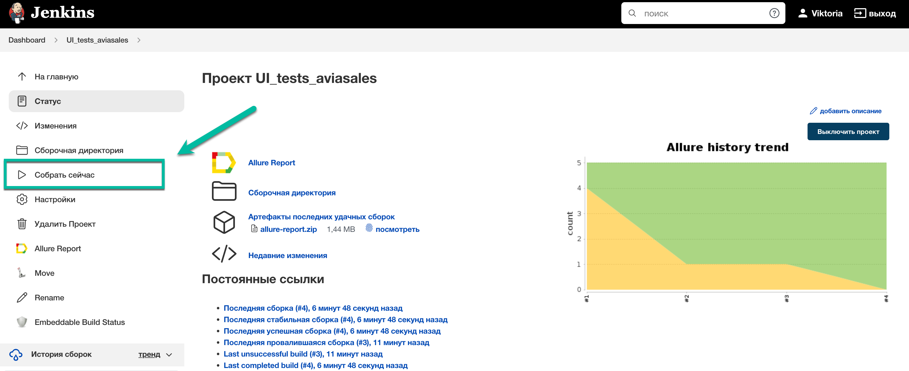

# Tests execution results report
> <a target="_blank" href="https://jenkins.autotests.cloud/job/UI_tests_aviasales/4/allure/">Link to Allure report</a>
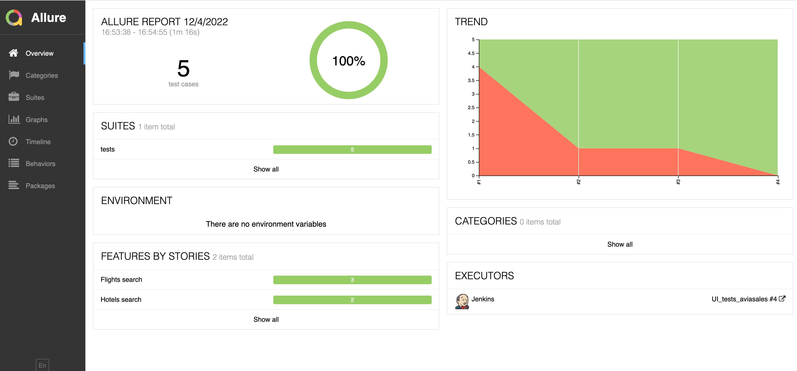

#### *At the end of autotests execution screenshot, page source, browser logs and test run video are available for every of them.*
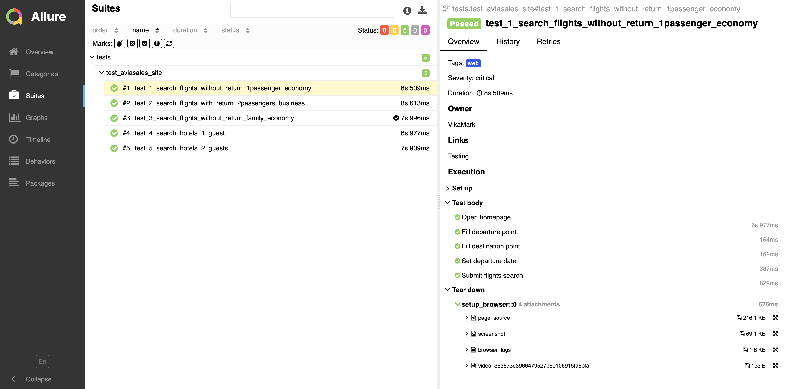

#### Graphs report tab
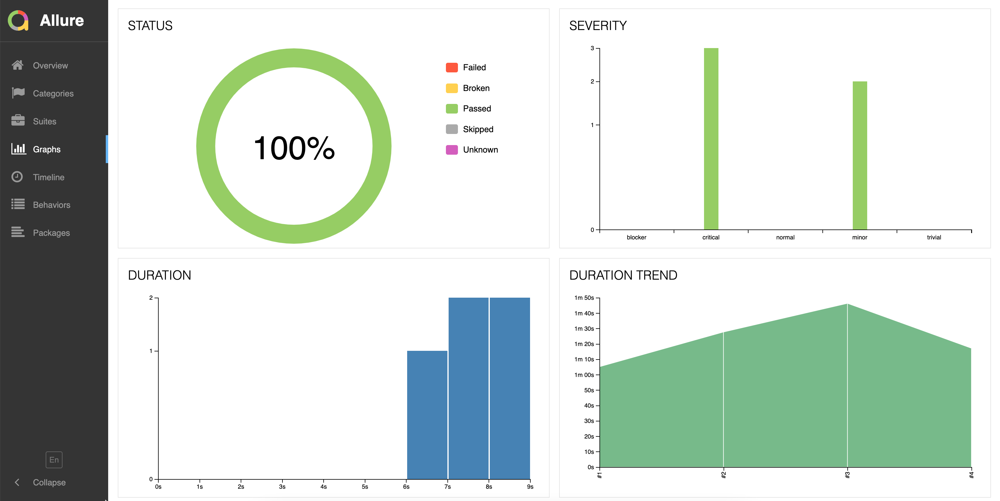

# Notification with Jenkins build results report is sent automatically to Telegram-bot
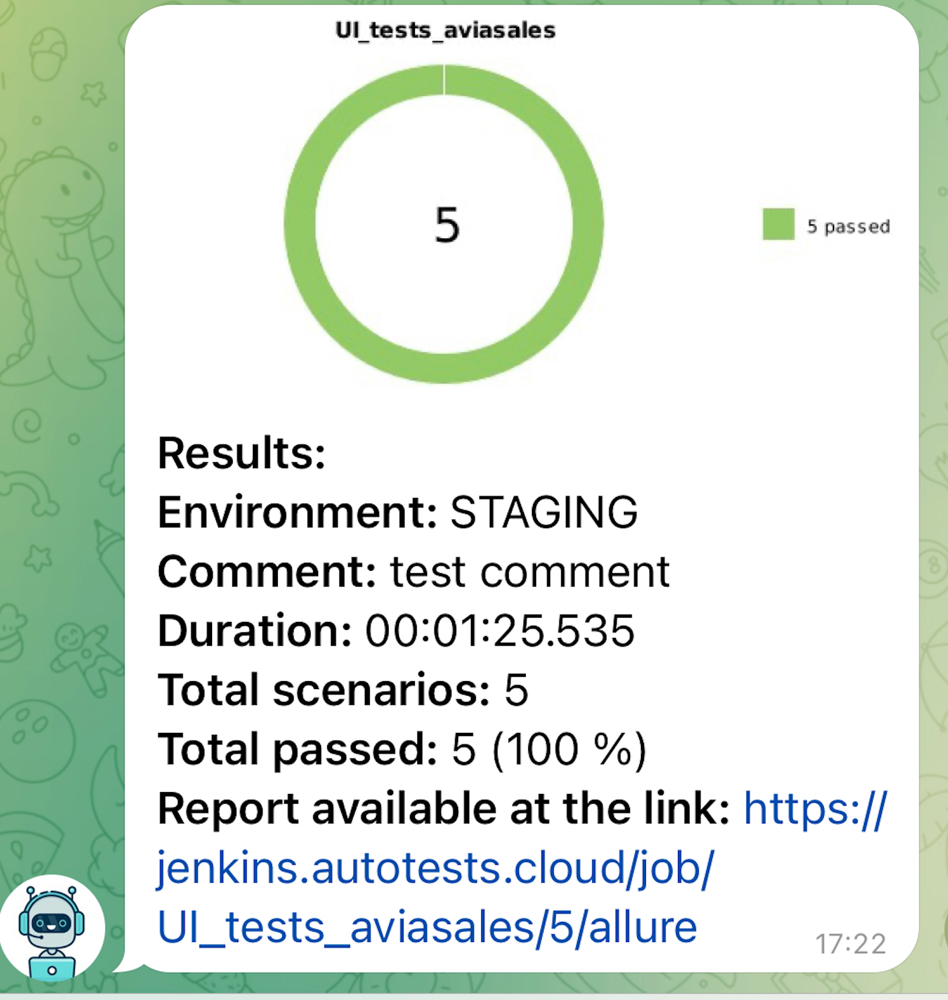

# Allure TestOps project provides test cases (auto and manual) and tests launch data
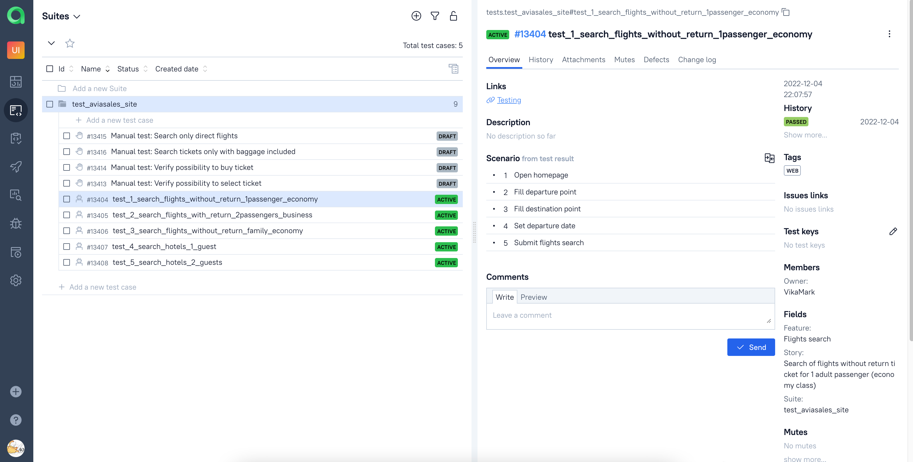
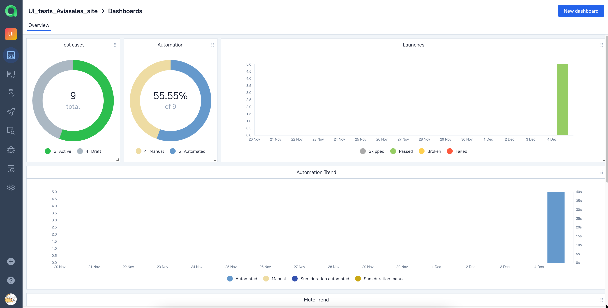

# Autotests and manual test cases as well as information of autotests launches are integrated in Atlassian Jira
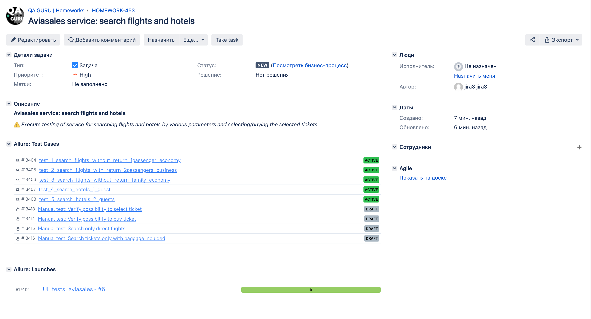
